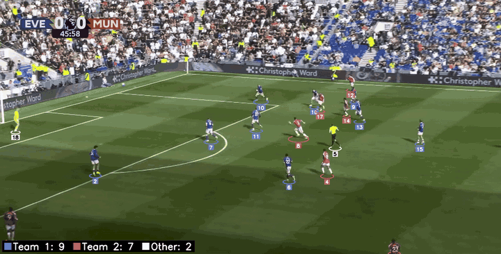

# Match Video Tracker

Football match analysis from broadcast video: detect every player, track them across frames, split them into teams, follow the ball and draw broadcast-style player spotlights.



*v1: every player keeps one ID and gets a marker in his team's shirt colour; white = referee and goalkeeper. Clip: a few seconds of Everton v Manchester United (Premier League broadcast), used for a non-commercial student project.*

> 🚧 Work in progress, built one milestone at a time while learning computer vision.

## Roadmap

| Milestone | What it does | Status |
| --- | --- | --- |
| M1 Detect | Find the players in a frame and remove the crowd | ✅ Done |
| M2 Track | Keep one ID per player across frames | ✅ Done |
| M3 Teams | Split the players into two teams by shirt colour | ✅ Done |
| M4 Ball and possession | Find the ball and compute possession | ⏳ |
| M5 Camera motion | Separate camera movement from player movement | ⏳ |
| M6 Spotlight | Ring and trace under a player, drawn under the players | ⏳ |
| M7 Studio app | Click a player in a Streamlit app and export an mp4 | ⏳ |

Releases: v1 = M1–M3 ✅, v2 = M4–M6, v3 = M7.

## How it works (v1)

1. **Detect (M1).** YOLO26 finds every person in the frame. People whose feet are not on grass are the crowd, so they are removed.
2. **Track (M2).** The TrackTrack tracker gives each player an ID. When a player is hidden behind someone and comes back with a new ID, pandas joins the two pieces if the timing, position and shirt colour all match.
3. **Teams (M3).** Each player's shirt colour is measured in the Lab colour space, which cares less about shadows than RGB. K-Means finds the two team colours, with spare groups so that the referee and the keepers cannot pull them. Anyone far from both team colours is "other".
4. **Repair with colour (M3).** If an ID changes from a blue shirt to a red shirt for good, the tracker swapped two opponents in a tackle. The track is cut there, and the pieces are joined to the right players again.

## Tech stack

Python, NumPy, OpenCV, Ultralytics YOLO26, TrackTrack and BoT-SORT tracking, pandas, scikit-learn (K-Means) and pytest. Streamlit joins in M7.

## Setup (macOS)

```bash
git clone https://github.com/San-Ngo/match_video_tracker.git
cd match_video_tracker
python3 -m venv .venv
source .venv/bin/activate
pip install -r requirements.txt
pytest -q
```

Put your own match clips in `data/`. Videos and model weights stay on your computer and are not stored in the repo.

## Run it

Activate the environment first (`source .venv/bin/activate`), then:

```bash
python m1_detect.py data/frame.png
python m1_detect.py data/clip.mov
python m2_track.py data/clip.mov
python m3_teams.py data/clip.mov
```

- **M1** saves `outputs/m1_detect.jpg` (or `.mp4`). Green boxes are players; thin red boxes are people removed as crowd.
- **M2** saves `outputs/m2_track.mp4` with an ID under every player (TrackTrack by default; add `--tracker trackers/botsort.yaml` to compare), plus `outputs/tracks.csv` (one row per player per frame) and `outputs/tracks_clean.csv`. The clean table joins broken tracks: when a player is hidden behind someone and comes back with a new ID, he gets his old ID back if the timing, position and shirt colour all match.
- **M3** starts from M2's `tracks_clean.csv`, so run M2 on the same clip first. There is no YOLO in this step, so it takes well under a minute. It saves `outputs/m3_teams.mp4` with every marker in its team's shirt colour, `outputs/m3_check.jpg` (3 frames to check the teams by eye), `outputs/teams.csv` (one row per player) and `outputs/tracks_teams.csv` (the tracks with a team column).

## Known limits

- Kits that differ only in brightness (white against black) look the same in a*/b*, the two Lab colour numbers used here.
- Both teams must be on screen. With only one team, K-Means splits it in two.
- Colour cannot catch an ID swap between two teammates.

## Project structure

```
match_video_tracker/   the code, one module per job
tests/                 pytest tests
data/                  your clips (not on GitHub)
outputs/               results (not on GitHub)
docs/                  the demo GIF
practice/              small learning scripts
trackers/              tracker settings (TrackTrack, BoT-SORT)
m1_detect.py           Milestone 1: detect players, remove the crowd
m2_track.py            Milestone 2: track players with IDs
m3_teams.py            Milestone 3: split the players into two teams
notes.md               what I learned each week
```

## License

AGPL-3.0, the same license as Ultralytics YOLO, which this project builds on.
